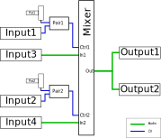

# Demiure Sound Processing Engine

The Demiurge Sound Process Engine (DSPE) is a zero-latency, streaming digital 
sound, processing platform that handles the real-time aspect of the Demiurge
family of products from Awesome Audio Apparatus.

The principle is that the programmer binds blocks together during startup,
on how the digital samples should propogate from block to block and eventually
reach the outputs. The timing and execution of that in real-time is handled
by the DSPE and the maker, implementor or advanced user can focus on the
(possibly no) other tasks that should be handled.

## Example - Dual VCA
The following code is a Dual VCA configuration.



And to code that up, we need to declare each of the ***Inputs***, ***Outputs***, 
***ControlPairs*** and the ***Mixer***, as follows

```C
#include "demiurge.h"

static audio_inport_t in1;      // Declaration of Audio Input Ports
static audio_inport_t in2;

static control_pair_t pair1;    // Declaration of CV+Potentiometer Input pairs
static control_pair_t pair2;

static audio_outport_t out1;    // Declaration of Audio Output Ports
static audio_outport_t out2;

static mixer_t mixer;           // Declaration of a Mixer block

/*
 * A two port Mixer, with CV control
 */
void setup() {
// Initialize the hardware configuration
control_pair_init(&pair1, 1);       // CV+Pot at the top of Demiurge
control_pair_init(&pair2, 2);       // CV+Pot at the second position from the top of Demiurge
audio_inport_init(&in1, 3);         // Audio In on third input from the top
audio_inport_init(&in2, 4);         // Audio In on fourth input from the top
audio_outport_init(&out1, 1);       // Audio Out on left output channel
audio_outport_init(&out2, 2);       // Audio Out on right output channel

// Initialize Mixer with 2 channels.
mixer_init(&mixer, 2);

// Connect in1 on mixer channel 1, with pair1 as the volume control
mixer_configure_input(&mixer, 1, &in1.me, &pair1.me);

// Connect in2 on mixer channel 2, with pair2 as the volume control
mixer_configure_input(&mixer, 2, &in2.me, &pair2.me);

// Connect mixer output to out1
audio_outport_configure_input(&out1, &mixer.me);

// Connect mixer output to out2
audio_outport_configure_input(&out2, &mixer.me);
}

void loop() {
}
```

The `setup()` and `loop()` functions are also custom, just to create a 
familiarity from the Arduino environment. In reality, this is defined in
our `main.c` file, after starting the DSPE and part of the creatioin of
a Demiurge project for the STM32CubeMX and optionally the STM32CubeIDE.

```C
   demiurge_start();
   setup();
   while (1) {
      loop();
```

